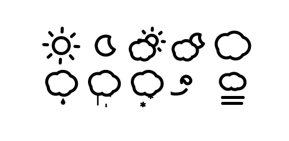

# React Animated Weather

Animated weather component for React inspired by Skycons http://darkskyapp.github.io/skycons/ :sunny:

[](https://travis-ci.org/divyanshu013/react-animated-weather)
[](https://www.npmjs.com/package/react-animated-weather)
[](https://www.npmjs.com/package/react-animated-weather)



## Installation

**React Animated Weather** is available as a node package. Get it via `yarn` or `npm`:

```bash
yarn add react-animated-weather
```

-or-

```bash
npm install react-animated-weather
```

If using `npm` < 5, you might want to save to your `package.json`:

```bash
npm install --save react-animated-weather
```

`react-animated-weather` also has peer dependencies on `react`, `react-dom` and `prop-types`.

## Usage

Import the ReactAnimatedWeather component:

```javascript
import ReactAnimatedWeather from 'react-animated-weather';
```

Sample usage:

```javascript
import React from 'react';
import ReactAnimatedWeather from 'react-animated-weather';

const defaults = {
  icon: 'CLEAR_DAY',
  color: 'goldenrod',
  size: 512,
  animate: true
};

const App = () => (
  <ReactAnimatedWeather
    icon={defaults.icon}
    color={defaults.color}
    size={defaults.size}
    animate={defaults.animate}
  />
);

export default App;
```

Props:

- **icon:** Takes a string to display the corresponding icon out of the following
  - CLEAR_DAY
  - CLEAR_NIGHT
  - PARTLY_CLOUDY_DAY
  - PARTLY_CLOUDY_NIGHT
  - CLOUDY
  - RAIN
  - SLEET
  - SNOW
  - WIND
  - FOG

- **color:** Pass a color value or hex code to color the weather component, if not passed, by default *black* is picked

- **size:** Pass a number to size the weather component in pixels, if not passed, by default *64* is set as the size

- **animate:** Pass a boolean value, if *true* (by default), the weather component will animate and if *false*, the weather component will remain static without any animation

Here are the default props used by ReactAnimatedWeather component:

```javascript
ReactAnimatedWeather.defaultProps = {
  animate: true,
  size: 64,
  color: 'black'
};

ReactAnimatedWeather.propTypes = {
  icon: PropTypes.oneOf([
    'CLEAR_DAY',
    'CLEAR_NIGHT',
    'PARTLY_CLOUDY_DAY',
    'PARTLY_CLOUDY_NIGHT',
    'CLOUDY',
    'RAIN',
    'SLEET',
    'SNOW',
    'WIND',
    'FOG'
  ]).isRequired,
  animate: PropTypes.bool,
  size: PropTypes.number,
  color: PropTypes.string
};
```

## Development

I've added a `storybook` for the component since it has a small number of props and the `storybook` interface is quite good for testing out
the component. You can fire up the `storybook` by running:

```bash
yarn storybook
```

-or-

```bash
npm run storybook
```

## Motivation

I got inspired to write this component from [darkskyapp's](https://github.com/darkskyapp) [Skycons](http://darkskyapp.github.io/skycons/). It makes use of the `<canvas>` element to render beautiful animated weather components.

Working with `<canvas>` in virtual DOM is a bit tricky. ReactAnimatedWeather uses a [`ref`](https://facebook.github.io/react/docs/refs-and-the-dom.html) to refer to the DOM holding the `<canvas>` element and render the weather component on `componentDidMount()`.

If you've found any bugs, please open an issue on [github](https://github.com/divyanshu013/react-animated-weather/issues).
